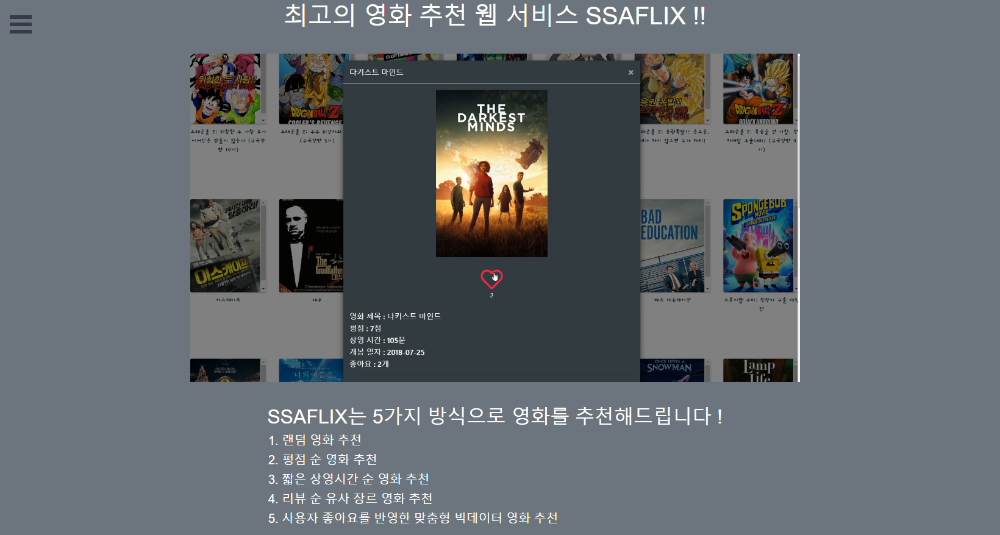
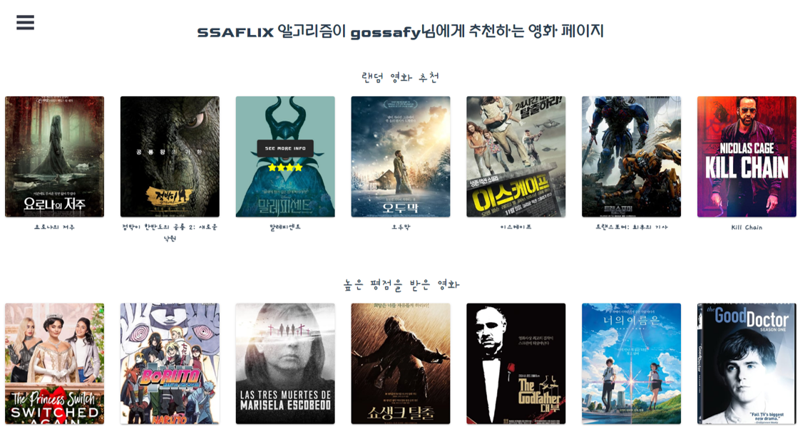
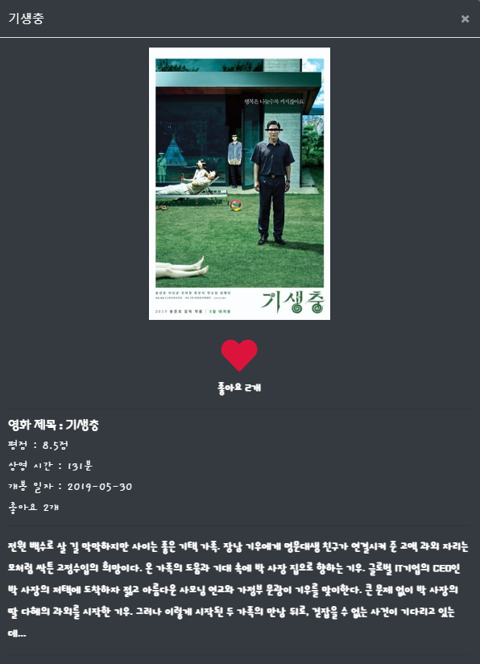
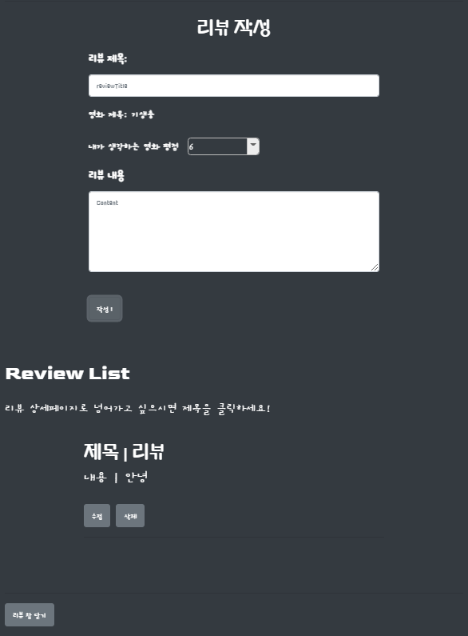
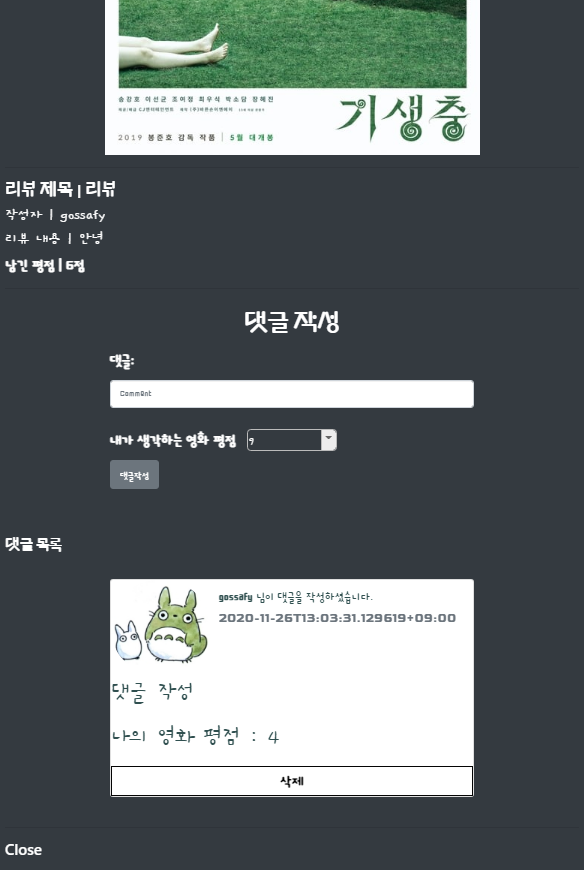
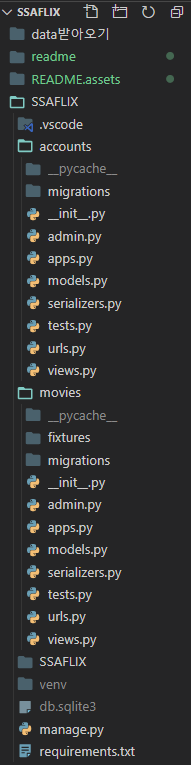
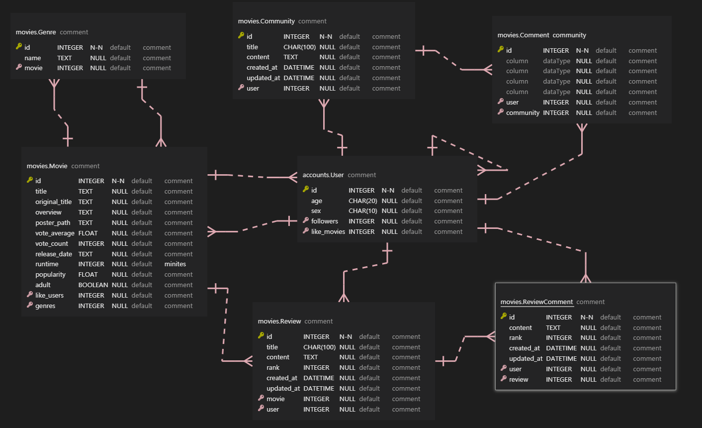

# SSAFLIX - 데이터 기반 영화 추천 웹 서비스


## 1. 팀원 정보

| 팀원 이름 | 업무 분담                                                    |
| --------- | ------------------------------------------------------------ |
| 신상훈    | 추천 알고리즘 작성 & Account 인증 기능 & Database 구축 & Follow, Like 기능 & CSS and Bootstrap |
| 이형창    | Django Modeling & Community 기능 구현 & 전체적인 Vue Front-end 디자인 주도 |

- 모든 팀원이 모든 기능 및 업무에 관여


## 2. 프로젝트 구조 - Vue.js(Front-end) & DRF(Back-end)


## 2.1 Vue.js (Front-end)


### 2.1.1 초기 화면




초기 화면에서 SSAFLIX의 영화 추천 방식과 웹 서비스 기능 및 사용방법을 영상으로 설명하고 있다.


### 2.1.2 Navbar


화면 왼쪽 상단 Navbar에서 로그인 상태에 따라

Intro(초기 화면), Recommend(영화 추천 페이지), Community(자유 게시판), Users(전체 유저 목록), MyProfile,  Logout, SignUp, Login 페이지로의 이동을 지원한다.


### 2.1.3 SignUp


회원가입은 username, age, sex, email 및 password 정보를 입력함으로 가능하다.


### 2.1.4 Login


Login 페이지에서, 회원가입을 하지 않은 사람을 SignUp 페이지로 유도한다.

로그인 된 회원은 JWT를 이용해 인증되게 된다.


### 2.1.5 Recommend




로그인을 완료하면, 사용자는 영화 추천 페이지로 자동 이동된다. 각 항목별로 glide 시스템을 이용해 추천받은 영화 목록을 넘기면서 확인할 수 있다.

영화 추천 방식은 다음과 같다.

1. 랜덤 영화 추천
   - 전체 영화에서 랜덤으로 30개의 영화를 추천한다.
2. 높은 평점 순 영화 추천
   - 전체 영화 중 평점이 가장 높은 영화 30개를 추천한다.
     - 초기 데이터로부터 각 영화는 **평균 평점(vote_average)**과 **투표 수(vote_count)**를 가지고 있고, SSAFLIX 회원이 평점과 함께 리뷰를 남기면 영화가 가지고 있는 평균 평점과 투표 수에 반영이 된다.
3. 상영 시간이 짧은 영화 추천
   - 가볍게 볼 수 있는 영화 30개를 추천하는 항목이다.
4. 최다 리뷰 순 추천
   - SSAFLIX 전체 회원이 리뷰한 영화 중, 리뷰 수가 가장 많은 30개 영화를 추천한다. 이 때 리뷰를 가진 영화가 30개 미만이라면 가장 먼저 리뷰된 영화와 같은 장르의 영화를 전체 데이터에서 가져와 부족한 수 만큼 추천한다.
     - 리뷰를 가진 영화가 하나도 없는 경우, 전체 데이터 중 **인기도(popularity)**가 가장 높은 30개 영화를 추천한다.
5. 내 좋아요 반영 추천
   - 내가 좋아요를 누른 영화에 좋아요를 누른 다른 회원들이 좋아요를 누른 모든 영화를 추천한다.
     - 내가 좋아요를 누른 영화가 없는 경우, 이 추천 항목은 보이지 않는다.


### 2.1.6 Movie Info


영화를 넘겨 보면서, 영화 포스터에 마우스를 가져다 대면 영화의 별점이 별의 갯수로 표시되고, 상세 정보를 확인할 수 있는 `SEE MORE INFO`버튼이 표시되도록 `vuetify` 의 `v-hover` 를 이용해 구현했다. 





포스터카드에 마우스를 가져대 나타나는 `MOVIE INFO` 버튼을 누르면, `modal` 형식의 영화 상세 정보 창이 나타난다.

영화 상세 정보 창에서는 영화 제목, 평점, 상영 시간, 개봉 일자, 영화 줄거리 및 좋아요 갯수를 확인할 수 있고, 비동기적 요청으로 해당 영화에 좋아요를 줄 수 있다.


### 2.1.7 Movie Review




영화 상세 정보 창에서 스크롤을 내리면, 해당 영화에 대한 리뷰를 작성할 수 있는 폼과 해당 영화에 대한 리뷰 리스트가 있다.

리뷰 작성은 리뷰 제목과 내가 생각하는 영화 평점, 리뷰 내용을 작성한다.

평점은 0점부터 10점까지 줄 수 있고, 이 때 부여되는 평점은 영화가 가진 평점 데이터에 반영된다.




리뷰 리스트 중 리뷰 하나의 제목을 클릭하면, 해당 리뷰 상세 정보 페이지 창이 새롭게 생성된다.

리뷰 상세 정보 페이지에는 해당 영화 제목, 포스터, 리뷰 제목, 작성자, 리뷰 내용 및 평점이 나타나고, 리뷰에 대한 댓글 작성 창을 같이 확인할 수 있다.

댓글 작성에는 내용과 댓글 작성자가 생각하는 영화 평점을 같이 기재하여 리뷰와 영화에 대한 의견을 주고 받을 수 있다.

리뷰 및 댓글은 작성자만 수정 및 삭제가 가능하다.


### 2.1.8 Community


Community(자유게시판) 에서 다른 회원들과 자유롭게 소통할 수 있다.

게시글 제목과 내용을 작성할 수 있고, 게시글 목록에는 글 번호, 게시글 제목 및 내용, 작성자가 표시된다.


게시글의 제목을 누르면 게시글 상세페이지로 이동한다. 상세페이지에는 작성자, 글 생성 및 수정시간, 내용이 나타나고, 댓글을 작성할 수 있다.

댓글 작성시 댓글 작성자의 프로필 사진을 가오나시로 귀엽게 설정해 보았다.


### 2.1.9 Users


전체 유저 목록을 확인할 수 있다.

유저 프로필에 마우스를 올리면 `hover`기능으로 유저 상세정보가 표시된다. 유저 이름, 이메일, 나이, 성별, 좋아요 한 영화 개수등이 표시된다. 페이스북, 트위터, 깃헙, 링크드 인으로 보내주는 링크도 있다.


### 2.1.10 User Profile


유저 프로필 페이지로 접속할 수 있다. Community, Community 댓글, Movie Review, Review 댓글 작성자의 아이디를 클릭하거나, 전체 유저 목록의 아이디를 클릭해 들어올 수 있다.

유저 프로필에는 해당 유저의 아이디, 이메일, 성별, 나이, 팔로우 및 팔로워 수, 유저가 좋아요를 누른 영화가 표시된다.

유저를 팔로우할 수 있다. 팔로우 버튼을 클릭하면 비동기적으로 버튼이 언팔로우 및 회색으로 변하게 되고, username을 팔로우 중입니다. 라는 메시지를 확인할 수 있다.

영화 추천 페이지에서와 같은 방식으로, 해당 유저가 좋아요를 누른 영화 목록을 확인하고, 상세 정보 및 리뷰 작성 창을 생성할 수 있다. 이러한 동작을 위해 영화 목록을 컴포넌트로 재사용했다.


## 2.2 Django Rest Framework (Back-end)


### 2.2.1 기본 구조



SSAFLIX Back-end Django Frame Work의 구조는 다음과 같다.

유저에 관련된 `accounts` app 과 영화에 관련된 `movies` app 을 사용한다.


### 2.2.2 초기 영화 데이터 생성

- get_data.py

```python
import urllib.request
from pprint import pprint
import json

API_KEY = "f0851e398bd229f1eaa14b1a2fb840ce"
HOST = "https://api.themoviedb.org"
MOVIE_LIST_URI = "/3/movie/popular"
MOVIE_INFO_URI = "/3/movie/"
GENRE_LIST_URI = "/3/genre/movie/list"

movie_list = []
movie_Ids = []
genre_list = []

genre_request = (f'{HOST}{GENRE_LIST_URI}?api_key={API_KEY}&language=ko')
response = urllib.request.urlopen(genre_request)
json_str = response.read().decode('utf-8')
json_object = json.loads(json_str)

genre_data = json_object.get("genres")

for data in genre_data:

    my_data = {
        "number": data.get("id"),
        "name": data.get("name")
    }

    my_genre = {
        "model": "movies.genre",
        "pk": my_data.get("number"),
        "fields": {
            "name": my_data.get("name")
        },
    }
    genre_list.append(my_genre)

for i in range(1, 50):
    request = (f'{HOST}{MOVIE_LIST_URI}?api_key={API_KEY}&language=ko&page={i}')
    response = urllib.request.urlopen(request)
    json_str = response.read().decode('utf-8')
    json_object = json.loads(json_str)

    data_movies = (json_object.get("results"))

    for movie in data_movies:
        movie_Ids.append(movie.get("id"))

for idx, movie_Id in enumerate(movie_Ids):
    movie_request = (f'{HOST}{MOVIE_INFO_URI}{movie_Id}?api_key={API_KEY}&language=ko&')
    response = urllib.request.urlopen(movie_request)
    json_str = response.read().decode('utf-8')
    json_object = json.loads(json_str)
    if json_object.get("poster_path"):
        if json_object.get("genres"):

            my_object = {
                "model": "movies.movie",
                "pk": idx+1,
                "fields": {
                    "title": json_object.get("title"),
                    "adult": json_object.get("adult"),
                    "popularity": json_object.get("popularity"),
                    "poster_path": json_object.get("poster_path"),
                    "release_date": json_object.get("release_date"),
                    "runtime": json_object.get("runtime"),
                    "vote_average": json_object.get("vote_average"),
                    "vote_count": json_object.get("vote_count"),
                    "overview": json_object.get("overview"),
                    "genres": [json_object.get("genres")[0].get("id")],
                    "original_title": json_object.get("original_title"),
                }  
            }
        else:
            my_object = {
                "model": "movies.movie",
                "pk": idx+1,
                "fields": {
                    "title": json_object.get("title"),
                    "adult": json_object.get("adult"),
                    "popularity": json_object.get("popularity"),
                    "poster_path": json_object.get("poster_path"),
                    "release_date": json_object.get("release_date"),
                    "runtime": json_object.get("runtime"),
                    "vote_average": json_object.get("vote_average"),
                    "vote_count": json_object.get("vote_count"),
                    "overview": json_object.get("overview"),
                    "genres": json_object.get("genres"),
                    "original_title": json_object.get("original_title"),
                }
            }
        movie_list.append(my_object)

with open('movies.json', 'w', encoding='UTF-8') as file:
    file.write(json.dumps(movie_list, ensure_ascii=False))

with open('genres.json', 'w', encoding='UTF-8') as file:
    file.write(json.dumps(genre_list, ensure_ascii=False))
```

초기 영화 데이터를 얻기위해 tmdb API를 이용했다. 사용한 API 데이터는 tmdb의 인기 영화 목록 중 980개 영화를 사용했고, 장르 데이터도 가져왔다.

API 요청에 따른 응답을 json 데이터로 받아, object로 변환시키고 우리가 사용할 인자만 가져와 새로운 object로 만드는 코드를 작성했다. 사용하기로 한 정보는 다음과 같다.

영화 title, 성인영화 여부, 인기도, 포스터 이미지 url, 개봉일자, 상영시간, 평균 평점, 투표 수, 줄거리, 장르, 원제목 등을 가진 object로 변환했다.

변환된 object를 장르와 영화에 대해 각각 `genres.json`, `movies.json`으로 자동 dump하도록 코드를 작성해 사용했다.

모델링을 마친 후, dump 시킨 json 파일들을 loaddata 하여 사용했다.


### 2.2.3 Django modeling & ERD

- 전체 모델 관계 ERD




- accounts/models.py

```python
from django.db import models
from django.contrib.auth.models import AbstractUser

# Create your models here.
class User(AbstractUser):

    SEX_CHOICES = {
        ('male', 'Male'),
        ('female', 'Female'),
    }

    age = models.CharField(max_length=20)
    sex = models.CharField(max_length=10, choices=SEX_CHOICES, null=False, default="male")

    followers = models.ManyToManyField('self', symmetrical=False, related_name='followings')
```


- movies/models.py

```python
from django.db import models
from django.conf import settings
from django.core.validators import MaxValueValidator, MinValueValidator


class Genre(models.Model):
    name = models.TextField()


class Movie(models.Model):
    title = models.TextField()
    original_title = models.TextField()
    overview = models.TextField()
    genres = models.ManyToManyField(Genre)
    poster_path = models.TextField()
    vote_average = models.FloatField(validators=[MinValueValidator(0), MaxValueValidator(10)])
    vote_count = models.IntegerField(validators=[MinValueValidator(0)])
    release_date = models.TextField()
    runtime = models.IntegerField(validators=[MinValueValidator(0)])
    popularity = models.FloatField(validators=[MinValueValidator(0)])
    adult = models.BooleanField()
    like_users = models.ManyToManyField(settings.AUTH_USER_MODEL, related_name='like_movies')

    
class Community(models.Model):
  user = models.ForeignKey(settings.AUTH_USER_MODEL, on_delete=models.CASCADE, related_name="communities")
  title = models.CharField(max_length=100)
  content = models.TextField()
  created_at = models.DateTimeField(auto_now_add=True)
  updated_at = models.DateTimeField(auto_now=True)


class Comment(models.Model):
  user = models.ForeignKey(settings.AUTH_USER_MODEL, on_delete=models.CASCADE, related_name="comments")
  content = models.TextField()
  created_at = models.DateTimeField(auto_now_add=True)
  updated_at = models.DateTimeField(auto_now=True)
  community = models.ForeignKey(Community, on_delete=models.CASCADE)


class Review(models.Model):
  user = models.ForeignKey(settings.AUTH_USER_MODEL, on_delete=models.CASCADE, related_name="reviews")
  title = models.CharField(max_length=100)
  content = models.TextField()
  rank = models.IntegerField(validators=[MinValueValidator(0), MaxValueValidator(10)])
  movie = models.ForeignKey(Movie, on_delete=models.CASCADE)
  created_at = models.DateTimeField(auto_now_add=True)
  updated_at = models.DateTimeField(auto_now=True)


class ReviewComment(models.Model):
  user = models.ForeignKey(settings.AUTH_USER_MODEL, on_delete=models.CASCADE, related_name="review_comments")
  content = models.TextField()
  rank = models.IntegerField(validators=[MinValueValidator(0), MaxValueValidator(10)])
  created_at = models.DateTimeField(auto_now_add=True)
  updated_at = models.DateTimeField(auto_now=True)
  review = models.ForeignKey(Review, on_delete=models.CASCADE)
```

모델은 User, Movie, Genre, Community, Comment, Review, ReviewComment가 있다.

우선 Genre 는 Movie가 여러개를 가질 수 있는 동시에, 같은 Genre의 Movie도 여러개 존재할 수 있기 때문에 M:N 관계를 설정하였다.

Movie의 경우, User가 여러개의 영화에 좋아요를 누를 수 있고 한 영화에 여러 User역시 좋아요가 가능하므로 M:N 관계를 설정하였다.

특정 Movie에 대해 여러개의 Review 작성이 가능하므로 Review와는 1:N 관계이다.

Review의 경우 특정 User가 여러 Review를 작성할 수 있으므로 1:N 관계를 설정하였고, 한 Review에 여러개의 ReviewComment를 달 수 있으므로 1:N 관계를 설정하였다. 동시에 ReviewComment는 User와 1:N 관계가 된다.

Community 역시 마찬가지로 User와 1:N 관계이며 Comment와는 하나의 게시글에 여러개 Comment인 1:N관계이다. Comment는 한 유저가 여러개를 가질 수 있는 1:N관계이다.


### 2.2.4 settings.py

```python
INSTALLED_APPS = [
    'movies',
    'accounts',

    'django.contrib.admin',
    'django.contrib.auth',
    'django.contrib.contenttypes',
    'django.contrib.sessions',
    'django.contrib.messages',
    'django.contrib.staticfiles',

    'rest_framework', # DRF를 위한 rest_framework pip install 후 등록(공식문서 확인)
    'corsheaders', # (공식문서 참조함) # CORS를 위한 앱 등록.
]

MIDDLEWARE = [
    'corsheaders.middleware.CorsMiddleware', # CORS를 위한 Middleware 세팅(공식문서 참조)
    'django.middleware.security.SecurityMiddleware',
    'django.contrib.sessions.middleware.SessionMiddleware',
    'django.middleware.common.CommonMiddleware',
    'django.middleware.csrf.CsrfViewMiddleware',
    'django.contrib.auth.middleware.AuthenticationMiddleware',
    'django.contrib.messages.middleware.MessageMiddleware',
    'django.middleware.clickjacking.XFrameOptionsMiddleware',
]

# vue origin 허용
CORS_ALLOWED_ORIGINS = [
    'http://localhost:8080', # 특정 origin의 요청만 허용하는데, Vue의 로컬호스트만 요청을 허용.
]

JWT_AUTH = {
    'JWT_EXPIRATION_DELTA': datetime.timedelta(days=1),
}
```

DRF 사용을 위해 `rest_framework` 설치 및 등록을 해주었고, Vue.js를 이용해 렌더링 된 웹 페이지에서 교차 출처 리소스 공유를 위해 `corsheaders` 설치 및 등록을 해주었다. 동시에 `MIDDLEWARE` 세팅 및 vue origin url을 허용할 수 있도록 `CORS_ALLOWED_ORIGINS`를 설정하였다.

유저 인증은 jwt를 이용하였다. 토큰은 하루동안 지속할 수 있도록 재설정하였다.


### 2.2.7 accounts & movies  serializers.py

- accounts/serializers.py

  ```python
  from rest_framework import serializers
  from django.contrib.auth import get_user_model
  
  
  User = get_user_model()
  
  class UserSerializer(serializers.ModelSerializer):
  
      password = serializers.CharField(write_only=True)
      
      class Meta:
          model = User
          fields = ('id', 'username', 'like_movies', 'password', 'age', 'sex', 'email', 'followings', 'reviews', 'followers',)
          read_only_fields = ('followings', 'reviews', 'like_movies', 'followers',)
  ```

user정보를 응답으로 받아도 password는 알 수 없도록 password에 `write_only=True` 를 적용시켰다.

응답에서 유저의 팔로잉 목록, 작성 리뷰 목록, 좋아요한 영화 목록, 팔로워 목록등을 받을 수 있으면서도, 유저 등록시에는 작성할 필요가 없도록 `read_only_fields`에 추가하였다.


- movies/serializers.py

  ```python
  from rest_framework import serializers
  from .models import Movie, Community, Comment, Review, ReviewComment
  
  
  class CommunityListSerializer(serializers.ModelSerializer):
    userName = serializers.SerializerMethodField()
    
    def get_userName(self,obj):
      return obj.user.username
  
    class Meta:
      model = Community
      fields = ('id', 'userName', 'user', 'title', 'content', 'created_at', 'updated_at',)
      read_only_fields = ('user',)
  
  
  class CommentSerializer(serializers.ModelSerializer):
    userName = serializers.SerializerMethodField()
    
    def get_userName(self,obj):
      return obj.user.username
  
    class Meta:
      model = Comment
      fields = ('id', 'userName', 'user', 'content', 'created_at', 'updated_at', 'community',)
      read_only_fields = ('user','community',)
  
  
  class MovieSerializer(serializers.ModelSerializer):
  
      class Meta:
  
          model = Movie
          fields = '__all__'
          read_only_fields = ('like_movies', 'like_users',)
  
  
  class ReviewListSerializer(serializers.ModelSerializer):
    movie_title = serializers.SerializerMethodField()
  
    def get_movie_title(self, obj):
      return obj.movie.title
  
    userName = serializers.SerializerMethodField()
    
    def get_userName(self,obj):
      return obj.user.username
  
    class Meta:
      model = Review
      fields = ('id', 'user', 'userName', 'title', 'content', 'movie', 'rank', 'created_at', 'updated_at', 'movie_title')
      read_only_fields = ('user',)
  
  
  class ReviewCommentSerializer(serializers.ModelSerializer):
    userName = serializers.SerializerMethodField()
    
    def get_userName(self,obj):
      return obj.user.username
  
    class Meta:
      model = ReviewComment
      fields = ('id', 'userName', 'user', 'content', 'review', 'rank', 'created_at', 'updated_at',)
      read_only_fields = ('user', 'review',)
  ```

`SerializerMethodField()`를 사용해 Review와 Community, 댓글 등에서 작성자의 이름을 응답으로 바로 받아올 수 있도록 작성하였다.


### 2.2.6 accounts & movies view 함수

- accounts

  - urls.py

    ```python
    from django.urls import path
    from rest_framework_jwt.views import obtain_jwt_token
    from . import views
    
    
    urlpatterns = [
        path('users/', views.users),
        path('signup/', views.signup),
        path('api-token-auth/', obtain_jwt_token),
        path('myprofile/', views.my_profile),
        path('follow/<int:my_pk>/<int:user_pk>/', views.follow),
        path('info/', views.users_info),
        path('<username>/', views.profile),
    ]
    ```

  - views.py

    ```python
    @api_view(['POST'])
    def signup(request):
        password = request.data.get('password')
        passwordConfirmation = request.data.get('passwordConfirmation')
        if password != passwordConfirmation:
            return Response({ 'error': '비밀번호가 일치하지 않습니다.'})
    
        else:
            serializer = UserSerializer(data=request.data)
            if serializer.is_valid(raise_exception=True):
                user = serializer.save()
                user.set_password(request.data.get('password'))
                user.save()
                return Response(serializer.data)
    ```

    회원가입을 위한 로직이다. 비밀번호를 두 번 작성하도록 하여 비밀번호를 잘못 입력하는 경우를 방지하였고, 비밀번호 정보를 해싱하여 저장하였다.

    

    ```python
    @api_view(['POST'])
    @authentication_classes([JSONWebTokenAuthentication])
    @permission_classes([IsAuthenticated])
    def my_profile(request):
        user = get_object_or_404(get_user_model(), pk=request.data.get('user_id'))
        serializer = UserSerializer(user)
        return Response(serializer.data)
    ```

    다른 요청 없이 내 유저 정보를 불러와야하는 경우 사용하는 my_profile 함수이다. jwt에 저장되어있는 `user_id`를 이용한다.

    

    ```python
    @api_view(['POST'])
    @authentication_classes([JSONWebTokenAuthentication])
    @permission_classes([IsAuthenticated])
    def profile(request, username):
        user = get_object_or_404(get_user_model(), pk=request.data.get('user_pk'))
        serializer = UserSerializer(user)
        return Response(serializer.data)
    ```

    

    ```python
    
    ```

    

